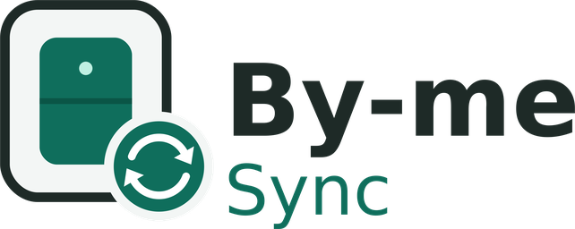

<p align="center">
  <picture>
    <source media="(prefers-color-scheme: dark)" srcset="custom_components/byme_sync/brand/dark_logo@2x.png">
    
  </picture>
</p>

[](https://hacs.xyz/docs/faq/custom_repositories)
[](https://github.com/TUO_UTENTE_GITHUB/byme_sync/actions/workflows/validate.yml)

# By-me Sync

Integrazione per Home Assistant che allinea lo stato dei carichi **Vimar By-me** che non hanno un indirizzo di stato: i relè integrati nei comandi a muro e le interfacce contatti. Si usa insieme all'integrazione **KNX** ufficiale.

## Il problema

Molti dispositivi By-me non inviano lo stato su un indirizzo di gruppo e non rispondono alle letture di gruppo. Home Assistant li segue finché è collegato al bus, perché vede passare i comandi, ma dopo un riavvio o una disconnessione non può sapere se sono accesi o spenti.

Il web server Vimar risolve il problema interrogando ogni dispositivo direttamente sul suo indirizzo fisico con una lettura di proprietà (`A_PropertyValue_Read`, oggetto 0, proprietà 202). By-me Sync fa la stessa cosa usando il collegamento KNX di Home Assistant.

## Quando interroga

1. all'avvio di Home Assistant, quando il collegamento KNX è pronto;
2. a ogni riconnessione del collegamento KNX (anche se l'integrazione KNX viene ricaricata);
3. con l'azione `byme_sync.aggiorna`.

Per ogni carico confronta lo stato letto con quello dell'entità. Se sono diversi chiama `turn_on` o `turn_off` sull'entità: il relè riceve lo stato che ha già, e l'entità e gli altri dispositivi sul bus si allineano.

## Installazione

**Con HACS**
1. HACS → menu ⋮ → **Repository personalizzati** → aggiungi `https://github.com/TUO_UTENTE_GITHUB/byme_sync`, categoria **Integrazione**.
2. Cerca **By-me Sync** e installala.
3. Aggiungi la configurazione a `configuration.yaml` (vedi `esempi/configuration.yaml`) e riavvia Home Assistant.

**A mano**

Copia la cartella `custom_components/byme_sync` in `config/custom_components/`, aggiungi la configurazione e riavvia.

Requisiti: integrazione KNX configurata e collegata al bus By-me tramite un'interfaccia KNX IP in tunneling.

## Configurazione

```yaml
byme_sync:
  carichi:
    - entita: light.luce_corridoio   # entità switch o light dell'integrazione KNX
      indirizzo: "1.0.31"            # indirizzo fisico del dispositivo con il relè
      blocco: 3                      # blocco funzionale (FB) del relè
```

Opzioni facoltative: `ritardo` (10 s), `allinea` (true), `timeout` (2 s), `tentativi` (2).

### Dove trovo indirizzo e blocco

Apri `strumenti/mappa-rele-byme.html` nel browser e carica il database del progetto EasyTool (`.db`). Per ogni gruppo vedi quale dispositivo contiene il relè e su quale blocco funzionale, e puoi copiare il YAML già pronto. Il file viene letto solo nel browser.

Attenzione: il mittente che vedi nel monitor quando premi un tasto è l'indirizzo del **pulsante**, che spesso non è il dispositivo con il relè.

## Strumenti

| Cartella | Contenuto |
|---|---|
| `strumenti/mappa-rele-byme.html` | Legge il database di EasyTool e prepara il YAML (vedi sopra). |
| `strumenti/icone/` | Sorgenti SVG di icona e logo, per tema chiaro e scuro, e lo script `genera_png.py` che rigenera le immagini di `brand/`. |

## Azioni

| Azione | Cosa fa |
|---|---|
| `byme_sync.aggiorna` | Legge tutti i carichi configurati (o solo le `entity_id` indicate) e corregge le entità. Può restituire il dettaglio dei risultati. |
| `byme_sync.leggi` | Legge un canale (`indirizzo`, `blocco`) e restituisce lo stato senza modificare niente. Utile per verificare un carico prima di aggiungerlo. |

## Log

```yaml
logger:
  logs:
    custom_components.byme_sync: debug
```

## Limiti

- Funziona solo con dispositivi che rispondono alla proprietà 202 come i relè dei comandi a muro e le interfacce contatti. Verifica ogni carico con `byme_sync.leggi`.
- Non è un prodotto Vimar e non è supportato da Vimar.
- Le icone dell'integrazione vengono mostrate da Home Assistant 2026.3 in poi.

---

## English

By-me Sync restores the state of **Vimar By-me** loads that have no status group address (wall-switch relays, contact interfaces) after Home Assistant starts or the KNX connection drops. It reads each channel directly from the device with a connectionless `A_PropertyValue_Read` (object 0, property 202, start index `(block - 1) * 4 + 1`), the same request the Vimar web server uses, through the existing KNX integration connection. Configure it in YAML with the entity, the device individual address and the functional block of the relay. `strumenti/mappa-rele-byme.html` finds these values in an EasyTool project database, entirely in the browser.

## Licenza

MIT. Vimar e By-me sono marchi dei rispettivi proprietari; questo progetto non è affiliato a Vimar.
